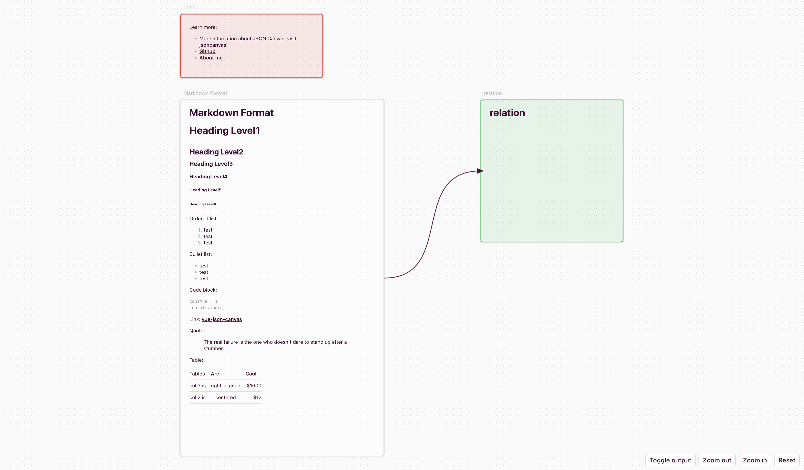

# vue-json-canvas

A Vue application that renders data from the JSON Canvas format. For more information about
JSON Canvas, visit [jsoncanvas.org](https://jsoncanvas.org).

## What is vue-json-canvas

`vue-json-canvas` is a Vue application specifically designed to render JSON Canvas files. It offers a collection of Vue components that interpret and visually display JSON Canvas data.

## Key Features

- **Render Basic JSON Canvas Structures**: Visualizes nodes and edges from JSON Canvas files.
- **Support for Markdown Content**: Renders Markdown within the canvas for rich text formatting.
- **Interactive Navigation**: Allows dragging, zooming in, and zooming out for easy exploration.
- **Lightweight and Easy Integration**: Easily integrates into Vue projects without adding significant overhead.

## Getting Started

Comming soon

## How to Contribute

We welcome contributions from the community. If you have any ideas or suggestions for improvement, please feel free to open an issue or submit a pull request.

## License

This project is licensed under the MIT License - see the [LICENSE](LICENSE) file for details.
