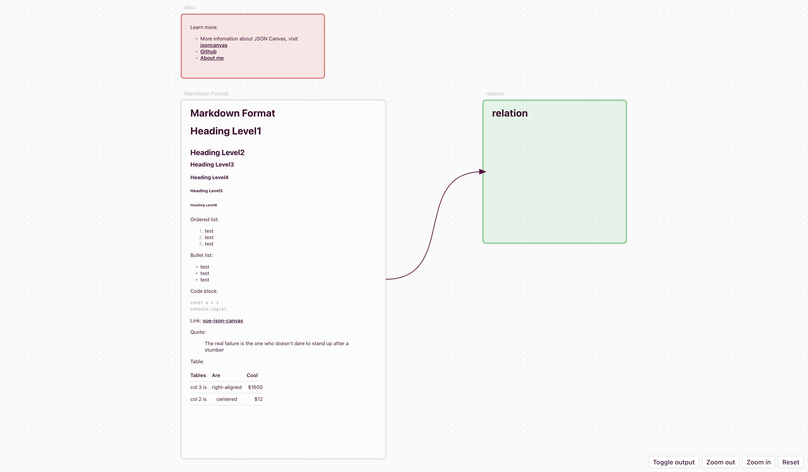

# vue-json-canvas

A Vue 3 renderer for the [JSON Canvas](https://jsoncanvas.org/) format.

JSON Canvas is an open file format for infinite canvas data. `vue-json-canvas` helps Vue applications render `.canvas` files as an interactive graph with positioned nodes, edges, Markdown content, dragging, and zooming.

[Live demo](https://vue-json-canvas.wujieli.com/) | [JSON Canvas spec](https://jsoncanvas.org/spec/1.0/)



## Features

- Render JSON Canvas nodes, groups, and edges.
- Display Markdown content inside canvas nodes.
- Pan, zoom, reset, and drag nodes on the canvas.
- Support mouse and touch-based navigation.
- Export TypeScript types for JSON Canvas-like data structures.
- Lightweight Vue 3 implementation with no backend dependency.

## Getting Started

This project is currently maintained as a source-level Vue component. A packaged npm release is on the roadmap.

Clone the repository and run the demo locally:

```bash
git clone https://github.com/wujieli0207/vue-json-canvas.git
cd vue-json-canvas
pnpm install
pnpm dev
```

Build the project:

```bash
pnpm build
```

## Source-Level Usage

The package entry exports the `Canvas` component and TypeScript types from `index.ts`.

```vue
<script setup lang="ts">
import { Canvas, type ICanvasContent } from './index'

const canvasContent: ICanvasContent = {
  nodes: [
    {
      id: 'idea',
      type: 'text',
      x: 80,
      y: 80,
      width: 260,
      height: 160,
      label: 'Idea',
      text: 'Render **Markdown** inside a JSON Canvas node.',
      color: '5',
    },
    {
      id: 'next-step',
      type: 'text',
      x: 440,
      y: 140,
      width: 260,
      height: 140,
      label: 'Next step',
      text: 'Connect Vue apps to portable canvas data.',
      color: '4',
    },
  ],
  edges: [
    {
      id: 'edge-1',
      fromNode: 'idea',
      fromSide: 'right',
      toNode: 'next-step',
      toSide: 'left',
      toEnd: 'arrow',
    },
  ],
}
</script>

<template>
  <Canvas :canvas-content="canvasContent" />
</template>
```

## Data Shape

```ts
export interface ICanvasContent {
  nodes: INode[]
  edges: IEdge[]
}

export interface INode {
  id: string
  type: string
  x: number
  y: number
  width: number
  height: number
  label?: string
  text?: string
  color?: '1' | '2' | '3' | '4' | '5' | '6'
}

export interface IEdge {
  id: string
  fromNode: string
  fromSide: 'left' | 'right' | 'top' | 'bottom'
  fromEnd?: 'none' | 'arrow'
  toNode: string
  toSide: 'left' | 'right' | 'top' | 'bottom'
  toEnd?: 'none' | 'arrow'
  label?: string
}
```

## Security

`vue-json-canvas` renders user-provided canvas content, including Markdown, inside Vue components. That makes input validation, Markdown sanitization, link handling, and rendering regressions important for real-world usage. Security review is especially relevant before broader package distribution.

## Roadmap

- Publish a reusable npm package.
- Add complete JSON Canvas spec fixtures.
- Add automated rendering and interaction tests.
- Harden Markdown rendering and sanitization.
- Improve documentation for embedding the component in Vue projects.
- Add release notes and versioned changelogs.

## Contributing

Issues and pull requests are welcome. Useful contributions include JSON Canvas compatibility fixes, rendering edge cases, touch interaction improvements, documentation, tests, and security hardening.

Before opening a pull request, run:

```bash
pnpm build
```

## License

This project is licensed under the MIT License. See [LICENSE](LICENSE) for details.
